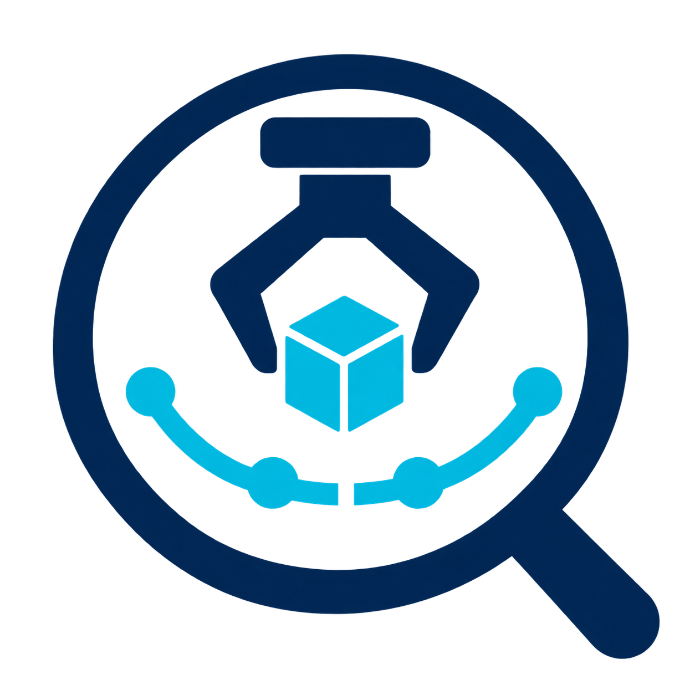
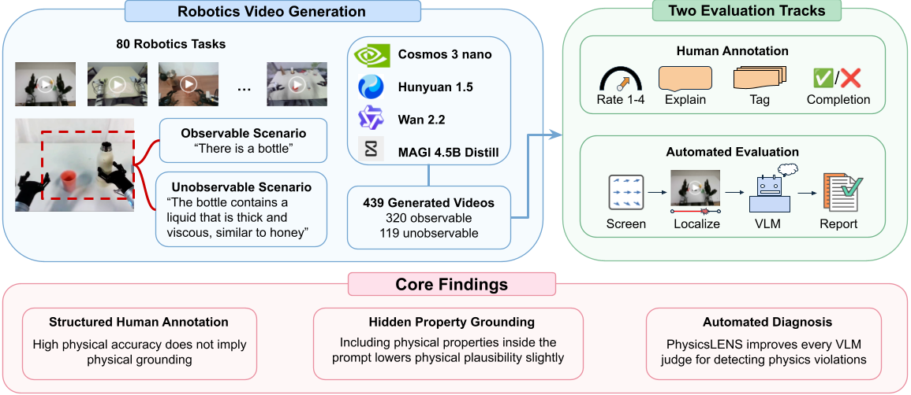
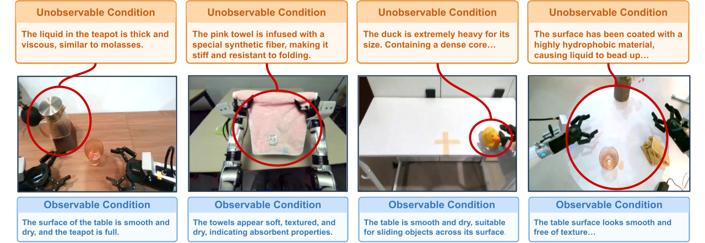

<p align="center">
  
</p>

[Quick Start](#quick-start) | [Benchmark Workflow](#benchmark-workflow) | [Diagnostic Tool](#diagnostic-tool) | [Citation](#citation) | [License](#license-and-disclaimer)

# PhysicsLENS: Diagnosing physical property blindness in video generation models

<p align="center">
  
</p>

PhysicsLENS is a benchmark and evaluation toolkit for physical plausibility and
physical-property grounding in generated robot videos. It asks whether a video
model follows a physical property that is stated in text but cannot be read off
the conditioning frame — and measures that separately from whether the video
looks physically plausible.

This repository contains the offline evaluator used for the paper's automated
results and an interactive diagnostic tool.

Paper: [arxiv.org/abs/2610.01162](https://arxiv.org/abs/2610.01162)<br>
Dataset: [huggingface.co/datasets/swiftrando/PhysicsLENS](https://huggingface.co/datasets/swiftrando/PhysicsLENS)

### Key Features:
- **Matched scenario pairs**: 80 observable scenarios and 30 hidden-property variants. Each pair keeps the same conditioning frame and task; only the scene description changes, to state a property (viscosity, surface condition, elasticity, mass) the image does not reveal.

<p align="center">
  
</p>
- **Real robot starting frames**: drawn from 11 public robot datasets covering humanoid, dual-arm, single-arm and mobile manipulators.
- **Four video generators**: Wan 2.2, Cosmos 3 Nano, HunyuanVideo 1.5 and MAGI 4.5B Distill, giving 439 generated videos (320 observable, 119 unobservable).
- **Separate human judgments**: physical plausibility (1–4), task completion (yes/no), adherence to the stated property (1–4, unobservable videos only), and violation labels.
- **Automated evaluator**: ten open-weight VLMs answering targeted questions, combined with 38 motion and embedding signals, evaluated against the human labels with grouped cross-validation.

> **Two configurations.** The paper's automated results evaluate the **offline
> evaluator** (`backend/scripts/`). The **interactive diagnostic tool**
> (`backend/pipelines/`, `frontend/`) assembles candidate diagnoses alongside
> visual and motion-derived signals; the paper's results do not validate its
> temporal localization, object attribution, or generated explanations.

---

## Quick Start

Choose one:

- [**Benchmark Workflow**](#benchmark-workflow): reproduce the paper's automated-evaluation results, either from the included precomputed outputs or by rerunning inference on the dataset.
- [**Diagnostic Tool**](#diagnostic-tool): run the interactive web tool on your own videos.

Both share one environment:

```bash
git clone https://github.com/Isaiah-Milkey/PhysicsLENS-benchmark.git
cd PhysicsLENS-benchmark

conda create -n physicslens python=3.11 -y
conda activate physicslens
pip install -r backend/requirements.txt
```

`backend/requirements.txt` is CPU-only. Local VLMs, SAM 3 and DINOv2 additionally need a CUDA host and:

```bash
pip install -r backend/requirements-gpu.txt   # torch, transformers>=5.5, accelerate, ...
hf auth login                                 # SAM 3 (facebook/sam3) is gated on Hugging Face
```

## Benchmark Workflow
<details open>
<a id="benchmark-workflow"></a>

Run all commands from the repository root.

### A. Regenerate the paper's tables from precomputed outputs (no videos, GPU, or API key)

`results/consol/` contains the per-model VLM answers, the Stage-1/2 signals, the
DINOv2 embedding-dynamics signals, and the clip manifest with human labels.

```bash
mkdir -p data && cp -r results/consol data/consol   # the scripts read data/consol/

python backend/scripts/system_eval.py --data data/consol --scope all
python backend/scripts/main_table_full.py
python backend/scripts/leader_final.py
python backend/scripts/paper_tables.py
```

| Script | Produces |
|---|---|
| `system_eval.py` | VLM-only, signals-only and combined AUCs → `data/consol/system_eval_all.json` |
| `main_table_full.py` | Main results table with fitted fusion weights → `paper/tables/main.tex`, `data/consol/main_table_full.json` |
| `leader_final.py` | Ten-VLM ensemble rows and within-generator AUC |
| `paper_tables.py` | Agreement, stage-ablation, per-model and per-family tables → `paper/tables/*.tex` |

Not reproducible from the precomputed outputs alone:
- Per-VLM mean ± sd over three frame offsets (`backbones_3run.py`, `backbones_sd.py`, `backbones_table.py`): needs the shifted-frame runs in `data/consol_fs1/` and `data/consol_fs2/`, which are not included.
- Sections of `consol_analyses.py` that read `data/consolidated_labels.csv` (produced in step C).
- Pairwise comparisons: the raw answers are included (`results/consol/pairwise_*.json`) and their metrics are recomputed by `consol_analyses.py`; regenerating the answers requires rerunning `pairwise_judge.py`.

### B. Download the dataset (to rerun inference)

```bash
hf download swiftrando/PhysicsLENS --repo-type dataset --local-dir data
```

The folder should have the following structure:

```plaintext
data/
├── manifest.csv                        # frame sources and licenses
└── physicslens_robot_data/
    ├── consolidated_annotations.csv    # human annotations, one row per video
    ├── consolidated_prompts_80.csv     # prompts, one row per scenario
    ├── Wan2.2_TI2V-5B/   Wan2.2_TI2V-5B_unobs/
    ├── cosmos3-nano/     cosmos3-nano_unobs/
    ├── hunyuan15/        hunyuan15_unobs/
    ├── magi/             magi_unobs/
    ├── real/                           # source demonstrations
    └── upscaled_720p/                  # conditioning frames
```

### C. Prepare videos, labels and frames

```bash
python backend/scripts/build_consolidated.py
python backend/scripts/eval_prepare.py --videos data/consolidated_videos \
  --labels data/consolidated_labels.csv --out data/consol --frames 8 --max-side 512
```

`build_consolidated.py` joins annotations, prompts and videos into `data/consolidated_labels.csv` and links each video into `data/consolidated_videos/<clip_id>.mp4` (symlinks; on Windows this needs Developer Mode or an elevated shell). Pass `--root <path>/physicslens_robot_data` if the dataset is elsewhere.

**Video accounting.** The annotation file has 442 records. The 3 records for scenario 91 (observable Wan 2.2, HunyuanVideo 1.5 and MAGI videos) are outside the benchmark and are dropped, leaving 439 videos: 320 observable and 119 unobservable. The unobservable HunyuanVideo 1.5 video for scenario 32 is absent.

`eval_prepare.py` freezes 8 frames per clip, evenly spaced, longer side 512 px:

**Parameters:**
- `--videos`: folder of video files (searched recursively).
- `--labels`: annotation table (CSV or JSON).
- `--out`: output dataset folder.
- `--frames`: frames per clip (default 8).
- `--max-side`: longest image side in pixels (default 512).
- `--seed`: seed for the stored shuffled frame order (default 0).

```plaintext
data/consol/
├── manifest.json            # one entry per clip, with human labels
└── frames/<clip_id>/000.jpg ... 007.jpg
```

### D. Compute motion and embedding signals

```bash
python backend/scripts/stage_signals.py --data data/consol --videos data/consolidated_videos
python backend/scripts/temporal_embed.py --data data/consol --device cuda:0
```

This gives 38 signals per clip: 28 motion and point-track signals (grayscale Farnebäck flow and Lucas–Kanade tracks over the first 5 s at 8 frames per second) and 10 DINOv2 embedding-dynamics signals. They are written to `data/consol/stage_signals.json` and `data/consol/temporal_embed.json`.

### E. Ask the VLM questions

Once per model:

```bash
python backend/scripts/vlm_plausibility.py --data data/consol --model <model> --frames 8
python backend/scripts/vlm_plausibility.py --data data/consol --model <model> --frames 8 --only plaus_debias
python backend/scripts/mcq_probe.py        --data data/consol --model <model> --frames 8
```

**Parameters:**
- `--model`: a local model key (mapped to a Hugging Face ID in `backend/scripts/videophy_eval_local.py`, e.g. `qwen2.5-vl-7b` → `Qwen/Qwen2.5-VL-7B-Instruct`) or, with `--api`, a model name on an OpenAI-compatible endpoint (`OPENAI_API_KEY`, optional `OPENAI_BASE_URL`).
- `--api`: use the hosted endpoint instead of a local model.
- `--device`: GPU for local models (default `cuda:0`).
- `--frames`: frames shown to the model (8; Llama-4-Scout used 4).
- `--only`: run specific questions only; `plaus_debias` is the physics-error question.

Qwen3-VL-32B and Llama-4-Scout-17B were run with `--api`; the other backbones ran locally.

Outputs: `data/consol/vlmplaus_<model>__f8.json`, `vlmplaus_<model>__f8__variant-plaus_debias.json`, and `mcq_<model>__f8.json`. For the three-offset spread, build shifted frame sets with `make_frame_seeds.py` and rerun the questions on `data/consol_fs1/` and `data/consol_fs2/`.

### F. Compute results

Run the commands in step A, skipping the `cp`.

<details>
  <summary>How the evaluation is defined</summary>

**Questions.** Each VLM sees the frames and the task. It answers: physical plausibility (1–4, standard and physics-error wording), task completion (yes/no), failure type (one forced choice over eight descriptions — seven constraint families plus object permanence — and "no physics problem", shuffled per clip), and, for unobservable clips only, adherence to the stated property (1–4). The prompts are in `vlm_plausibility.py` and `mcq_probe.py`.

**Scoring.** Each answer is read from the model's first-token probabilities: probabilities of the allowed answers are summed over surface forms (e.g. `"3"` and `" 3"`), renormalised over the allowed answers, and turned into an expected rating (1–4), P(yes), or a probability per option. Hosted models are read from the top-20 log probabilities. A missing answer is replaced by that model's mean score. Each output file stores the per-clip letter→option mapping.

**Targets.** AUC is ROC-AUC, computed over pooled out-of-fold predictions.

| Task | Clips | Positive class | Score (higher = more positive) |
|---|---|---|---|
| Physical plausibility | all 439 (also split 320 / 119) | human rating P ≥ 3 | expected plausibility rating |
| Task completion | all 439 | annotated as completed | P(yes) |
| Violation detection | all 439 | any recorded violation (333) vs none (106) | 1 − P(no physics problem) |
| Family attribution | violating videos | the family is among the clip's labels | P(family), one-vs-rest per family with ≥ 8 positives, averaged |
| Hidden-property adherence | 119 unobservable | human rating H ≥ 3 | expected adherence rating |

**Label mapping.** Human "Contact" labels are merged into Collision (a clip with both counts once). Object permanence has no human label: its probability counts toward violation detection (it is part of 1 − P(none)) but is not scored in family attribution.

**Combining evidence.** VLM scores are converted to ranks. For each target and fold, the five signals with the largest absolute Spearman correlation with the label are selected on the training folds, oriented, and rank-averaged; a single weight between the VLM rank and the signal rank is chosen on the training folds. Folds are 5-fold, grouped so that every version of a scenario (both conditions, all generators) is in the same fold (`paper_tables.folds`, seed 0).

**Inputs and supervision.** The adherence question receives the stated property and a scenario-level expected-outcome description, so this evaluation is reference-video-free, not expected-outcome-free. Signal selection and combination weights are fitted on human labels from training folds only.

**Uncertainty.** Bootstrap over videos (500 resamples) for single systems; standard deviation across the ten VLMs for averaged rows; standard deviation across three frame offsets for the per-VLM table.

</details>
</details>

## Diagnostic Tool
<details>
<a id="diagnostic-tool"></a>

### A. Start the server

```bash
cd backend
uvicorn main:app --reload --port 8000
```

Open `http://localhost:8000`; FastAPI serves the frontend too. To reach a server on a remote GPU host, forward the port: `ssh -L 8000:localhost:8000 <user>@<host>`.

### B. Credentials

Hosted-VLM pipelines read `OPENAI_API_KEY` (and optionally `OPENAI_BASE_URL`, for any OpenAI-compatible endpoint) or `OPENROUTER_API_KEY` from a `.env` file at the repository root, or from the pipeline's API-key field in the UI. Local open-weight models need no key.

### C. Pipeline stages

| Stage | Pipelines | Status |
|---|---|---|
| 1 — Screening | `temporal_smoothness`, `optical_flow_irregularities`, `embedding_biomarkers`, `vlm_suspicion` | Smoke-tested |
| 1 — Screening | `camera_motion` | Implemented |
| 2 — Localization | `object_tracker` (SAM 3 + VLM naming), `event_localizer`, `trajectory_extractor`, `physics_hypothesis_generator` (ranks candidate violation families) | Implemented |
| 3 — VLM verification | `specialist_mcq`: failure type (forced choice), task completion, and adherence to a stated property — the same questions as the offline evaluator | Experimental |
| 4 — Reporting | `diagnostic_report`: organizes findings into a structured report, with an optional LLM summary | Implemented |

*Smoke-tested*: executed end-to-end on short clips during development (clips not distributed). *Implemented*: available in code; test coverage may be incomplete. *Experimental*: output quality not yet established.

Stage 4 adds no validated score; the consistency number and severity bars in the UI are display aids, not calibrated estimates.

### D. Run without the UI

```bash
cd backend
python scripts/run_pipeline.py --list
python scripts/run_pipeline.py <pipeline_id> <video_path> --set key=val --prereq <stage_id>
```

Pipelines that use a local VLM load several GB of weights onto the GPU on first run.

### E. External services and deployment

When a hosted model is selected, `vlm_suspicion`, `object_tracker` naming, `physics_hypothesis_generator`, `specialist_mcq`, and the optional report summary send video frames (or, for the summary, report text) to the configured provider (an OpenAI-compatible endpoint, default api.openai.com, or OpenRouter). With a local model they do not.

The development server has no authentication. Do not expose it publicly without appropriate access controls.

Developer documentation (adding pipelines, event schema): [CONTRIBUTING.md](CONTRIBUTING.md).
</details>

---

## Citation

If you find PhysicsLENS useful, please cite:

```bibtex
@misc{milkey2026physicslensdiagnosingphysicalproperty,
      title={PhysicsLENS: Diagnosing Physical Property Blindness in Video Generation Models},
      author={Isaiah Milkey and Som Sagar and Aditya Taparia and Xinyuan Liu and Jiqing Wen and Ransalu Senanayake},
      year={2026},
      eprint={2610.01162},
      archivePrefix={arXiv},
      primaryClass={cs.CV},
      url={https://arxiv.org/abs/2610.01162},
}
```

## License and disclaimer

Copyright 2026 The PhysicsLENS Authors

All software is licensed under the Apache License, Version 2.0 (Apache 2.0);
you may not use this file except in compliance with the Apache 2.0 license.
See [LICENSE](LICENSE) and [NOTICE](NOTICE), or obtain a copy at
https://www.apache.org/licenses/LICENSE-2.0

The benchmark data is distributed separately on
[Hugging Face](https://huggingface.co/datasets/swiftrando/PhysicsLENS). Its
prompts, annotations and manifest are licensed under CC BY-NC-SA 4.0. The
conditioning frames come from public robot datasets and keep their original
licenses, listed per frame in the dataset's `manifest.csv`; frames whose license
forbids redistributing modified versions are not included.

Pretrained model weights downloaded at runtime (e.g. SAM 3, DINOv2, and the
open-weight VLMs) are not part of this repository and remain under their own
licenses and terms of use.

Unless required by applicable law or agreed to in writing, all software and
materials distributed here are distributed on an "AS IS" BASIS, WITHOUT
WARRANTIES OR CONDITIONS OF ANY KIND, either express or implied. See the
licenses for the specific language governing permissions and limitations under
those licenses.
